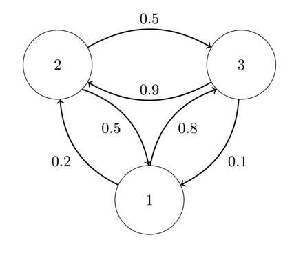
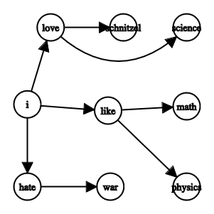
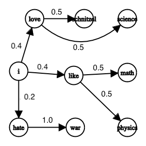

# markov-next-word
Next word prediction with no numpy (just a little bit for random stuff), no pytorch, no neural networks, no lstm, no transformers and so on.

* Just 60 lines of raw python and a little bit of math, enjoy ;)

## Usage (with all of shakespeare -> generate shakespeare like text)

#### Import and create a model.

```python
from src.markov_next_word import MarkovNextWord
NextWordPrediction = MarkovNextWord()
```
#### Train the model with your text data.

```python
# Replace data/shakespeare.txt with your data.
NextWordPrediction.train('data/shakespeare.txt')
```

#### Generate text

```python
# Generate text after love.
input_text = 'love'

# Num of words to generate.
sequence_length = 10
NextWordPrediction.generate_text(input_text, sequence_length)
```

#### Generated output
```console
love to my self to my friend and in thy heart
```

## What is a markov property?
In a process where the next state depends only on the current state, this property is called markov property.
A sequence of events which follow the Markov property is referred to as the Markov Chain.

### Short example

##### Lets define 3 states:

1: 'sun shines'
2: 'cloudy'
3: 'raining'

###### Define follwoing rules:

* Rule 1: Sunny → next day: 80% rain, 20% cloudy, 0% sun.
* Rule 2: Cloudy → next day: 50% rain, 50% sun, 0% cloudy.
* Rule 3: Rainy → next day: 90% cloudy, 10% rain, 0% rain.

###### The stochastic matrix could look like this:



##### Weather simulation

###### Today the sun is shining, predicting the weather in the next 7 days as follow.

```python
import numpy as np
from numpy.linalg import matrix_power

p = np.array([[0, 0.2, 0.8],
              [0.5, 0, 0.5],
              [0.1, 0.9, 0]])

# For example, we have sunday and the sun shines today.
v_start = np.array([1, 0, 0])

# Simulate 7 days.
# Day1 = Monday, ..., Day7 = Sunday
for day in range(1, 8):
    v = np.dot(v_start, matrix_power(p, day))
    prop_sun, prop_cloudy, prop_rain = round(100 * v[0], 2), round(100 * v[1], 2), round(100 * v[2], 2)
    print(f"Day: {day}, sun shines = {prop_sun}%, cloudy = {prop_cloudy}%, rain = {prop_rain}%")
```

```console
Day: 1, sun shines: 0.0%, cloudy: 20.0%, rain: 80.0%
Day: 2, sun shines: 18.0%, cloudy: 72.0%, rain: 10.0%
Day: 3, sun shines: 37.0%, cloudy: 12.6%, rain: 50.4%
Day: 4, sun shines: 11.34%, cloudy: 52.76%, rain: 35.9%
Day: 5, sun shines: 29.97%, cloudy: 34.58%, rain: 35.45%
Day: 6, sun shines: 20.83%, cloudy: 37.9%, rain: 41.27%
Day: 7, sun shines: 23.08%, cloudy: 41.31%, rain: 35.62%
```

## Next word prediction using markov property

### Consider following example data

```console
I like Math.
I like Physics.
I hate War.
I love Schnitzel.
I love Science.
```

### Mapping words to next words.

```console
i -> [like, like, hate, love, love]
like -> [math, physics]
hate -> [war]
love -> [schnitzel, science]
```
#### Graph representation



### Mapping word and next_word to its probability.

```console
(i, like) -> 0.4
(i, hate) -> 0.2
(i, love) -> 0.4
(like, math) -> 0.5
(like, physics) -> 0.5
(hate, war) -> 1.0
(love, schnitzel) -> 0.5
(love, science) -> 0.5
```
#### Graph representation with probabilitys



### Example using the model

```python
>>> from src/markov_next_word import MarkovNextWord
>>> mnw = MarkovNextWord()
>>> mnw.train('data/test.txt')
>>> mnw.word_to_nextwords
{'i': ['like', 'like', 'hate', 'love', 'love', 'love'], 'like': ['math', 'physics'], 'hate': ['war'], 'love': ['schnitzel', 'science']}
>>> mnw.word_to_next_word_prob
{('i', 'like'): 0.4, ('i', 'hate'): 0.2, ('i', 'love'): 0.4, ('like', 'math'): 0.5, ('like', 'physics'): 0.5, ('hate', 'war'): 1.0, ('love', 'schnitzel'): 0.5, ('love', 'science'): 0.5}
```